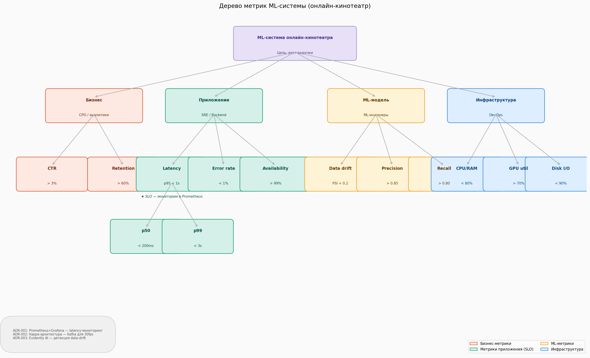
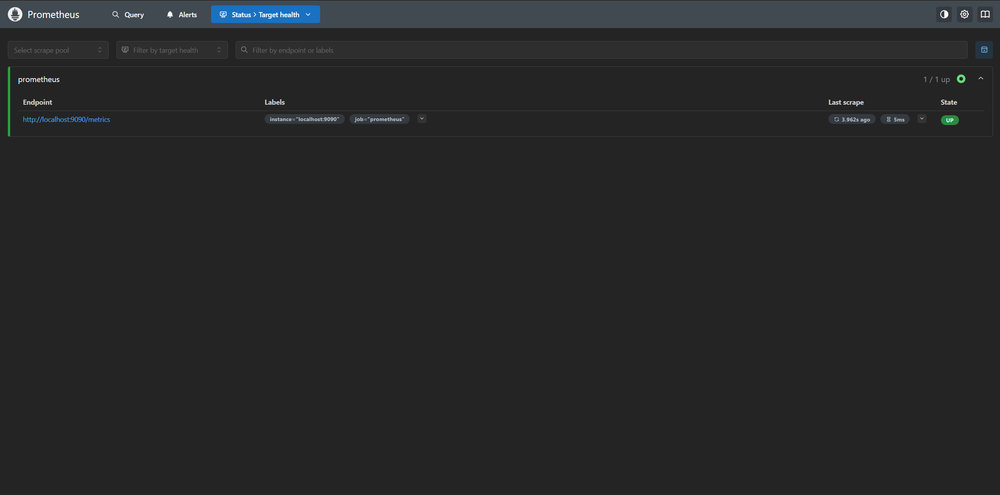
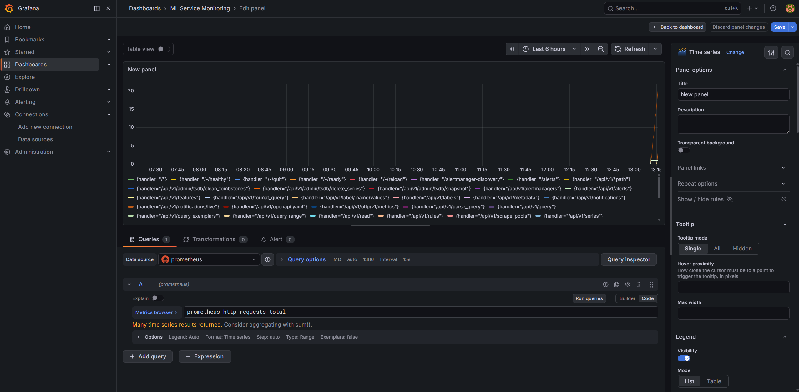
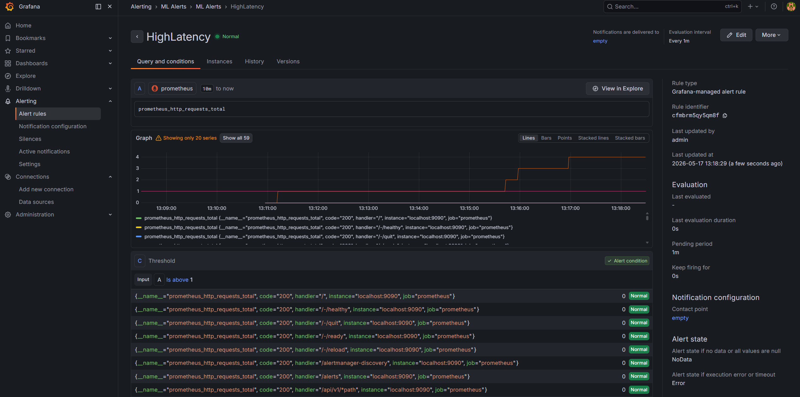
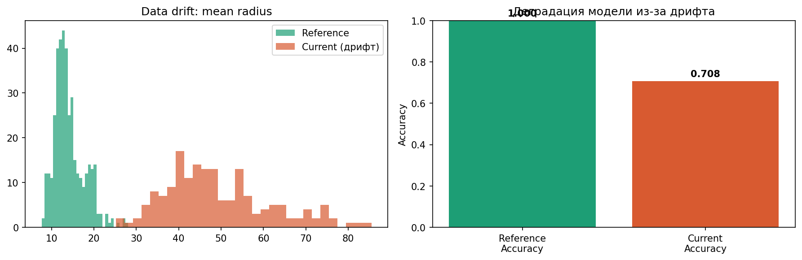
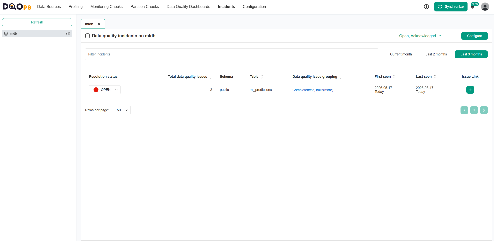
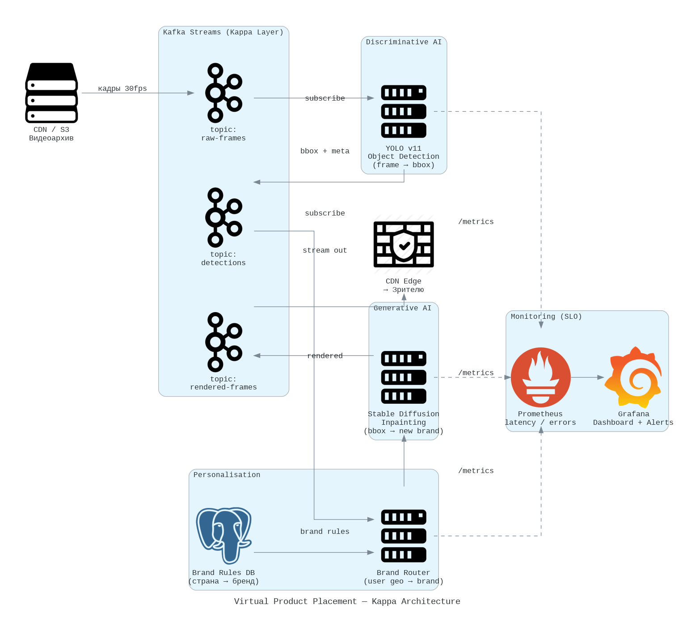

# HW8 — Мониторинг ML-системы

## SLO (Service Level Objectives)
- Latency p95 < 1s
- Error Rate < 1%
- Availability > 99%

## Шаг 1 — Дерево метрик
Четыре ветви: бизнес-метрики, метрики приложения, ML-метрики, инфраструктура.

## Шаг 2 — Prometheus + Grafana
Конфигурация в `prometheus.yml` и `grafana.yaml`.
Мониторим p95 latency ML-сервиса.

## Шаг 3 — Data drift и деградация модели
Использован Evidently AI. Reference — обучающая выборка.
Current — данные с искусственным дрифтом (×3.5 на половине признаков).
Результат: accuracy упала, дрифт зафиксирован.

## Шаг 4 — DQOps
Создана таблица ml_predictions в PostgreSQL.
Инцидент: NULL-значения в столбцах prediction и label.
DQOps зафиксировал инцидент типа Completeness/nulls.

## Шаг 5 — Архитектура Virtual Product Placement
Выбрана Kappa-архитектура (только стримы, Kafka).
Обоснование: видеопоток 30fps — real-time задача,
batch-слой не нужен, один пайплайн проще поддерживать.

